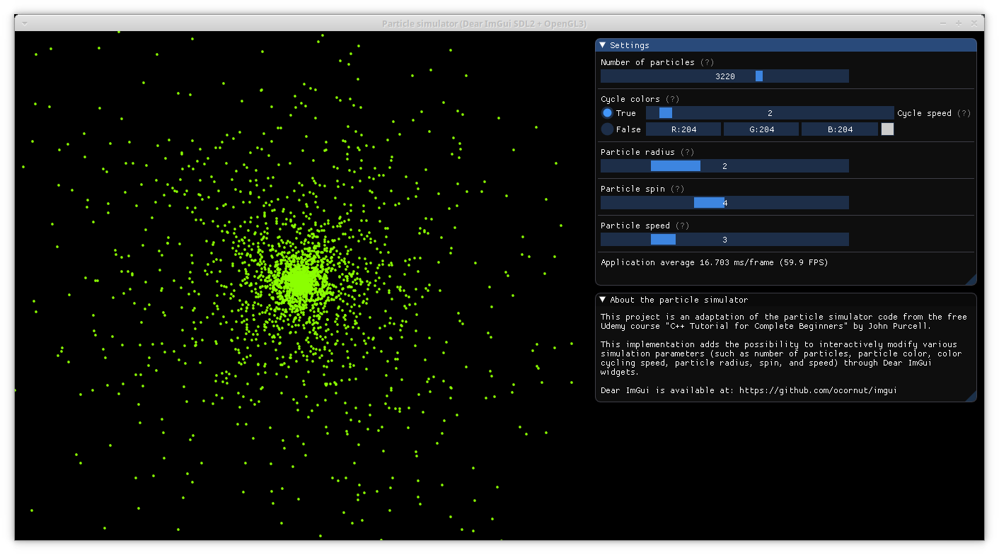

# ParticleSimulator
SDL + OpenGL particle simulator in C++ featuring ImGui widgets



This project is an adaptation of the particle simulator code from the free Udemy course [C++ Tutorial for Complete Beginners](https://www.udemy.com/free-learn-c-tutorial-beginners) by John Purcell. The current implementation adds the possibility to interactively modify various simulation parameters (such as number of particles, particle color, color cycling speed, particle radius, spin, and speed) through [Dear ImGui](https://github.com/ocornut/imgui) widgets.

## Dependencies

  * `cmake`
  * `make`
  * `g++`
  * `libsdl2-dev`
  * OpenGL 3
  
## Building the particle simulator

First, clone this repository:

```
git clone https://github.com/alexandra-zaharia/ParticleSimulator.git
```

Create the directory where the executable will be built and `cd` into it:

```
cd ParticleSimulator
mkdir build
cd build
```

Now run `cmake` and `make`:

```
cmake ..
make
```

Run the particle simulator from the `build` directory:

```
./ParticleSimulator
```

## Motivation

The motivation to build this project is purely personal: although the particle simulator does not "do" anything useful *per se*, it allowed me to dive (again) into C++, to reflect object oriented design, to use graphical frameworks, and to test out a C++ library for GUI creation.

## TODO
  * Add box blur effect
  * Add widget for blur radius
